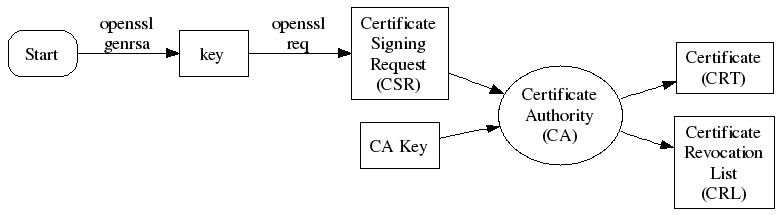

# pkey_tools 封装了常用的证书操作库

## 

## 封装的密钥生成算法
- RSA
- ECDSA
- ED25519

## OPENSSH-SSH2公钥结构

SSH 2 公钥格式
```
$ cat id-rsa.pub
ssh-rsa AAAAB3NzaC1yc2EAAAADAQABAAABAQDmg/9Hoc98c6AIlEPYK6VqE3ZTlMlfXqn2VgU0NAPXeRmYX+jHYZXA5AxMNTD8KgZIuilK23qzzKBy0hgoO9DDpsBg98Pf4NLkHjTcjpPFX1TBD6RWO/OX/g4uN+gZH1/zoREJa4fit8SSG2V2GoQkqrhfRYCy+a9mQX29ZvOLfYK/aMVjb+yfzLJychdvV3CQkDvkd5R/DHNU6ZQ3pyIEjA/cUQqqmgxQj0f72y8IXv8zesXtjXaaKG17R2oSN1MNDZo/y4m426MYxl4mMQMvM5yR3UvhD93pgNgaR8LY/vspcIeE6cJZsGl21oYtrDZ/GdmF5ulMGwjIDfTJRLvb root@hostname
```
<br>
SSH 2 公钥格式为所有字段以单个空格符分隔,各字段依次为选项/密钥类型(keytype)/base64编码后的密钥/注释,默认注释为密钥的创建者(一般就是 username@hostname 这种格式),仅作为一个辨识标记


## PEM格式

PEM 是明文格式,可以包含证书或者是密钥;其内容通常是以类似"—–BEGIN …—–" 开头"—–END …—–" 为结尾的这样的格式进行展示的;通过解码转换为 DER 格式

### 公钥 PEM 格式

- PKCS #1 标准是专门为 RSA 密钥进行定义的,其对应的 PEM 文件格式如下:

```
-----BEGIN RSA PUBLIC KEY-----
BASE64 ENCODED DATA
-----END RSA PUBLIC KEY-----
```

- PKCS#8 标准定义了一个密钥格式的通用方案,它不仅仅为 RSA 所使用,同样也可以被其它密钥所使用

```
-----BEGIN PUBLIC KEY-----
BASE64 ENCODED DATA
-----END PUBLIC KEY-----
注意,这里就没有 RSA 字样了,因为 PKCS#8 是一个通用型的秘钥格式方案;其中的 BASE64 ENCODED DATA 所标注的内容为 PEM 格式中对 DER 原始二进制进行的 BASE64 编码;
```

<br>
PKCS#8 虽然名字叫做 Private-Key Information Syntax Specification,但是实际上,它同样可以用作 Public Key 的格式定义;而 PKCS#8 是站在 PKCS#7 CMS 的基础之上进行编码格式定义的